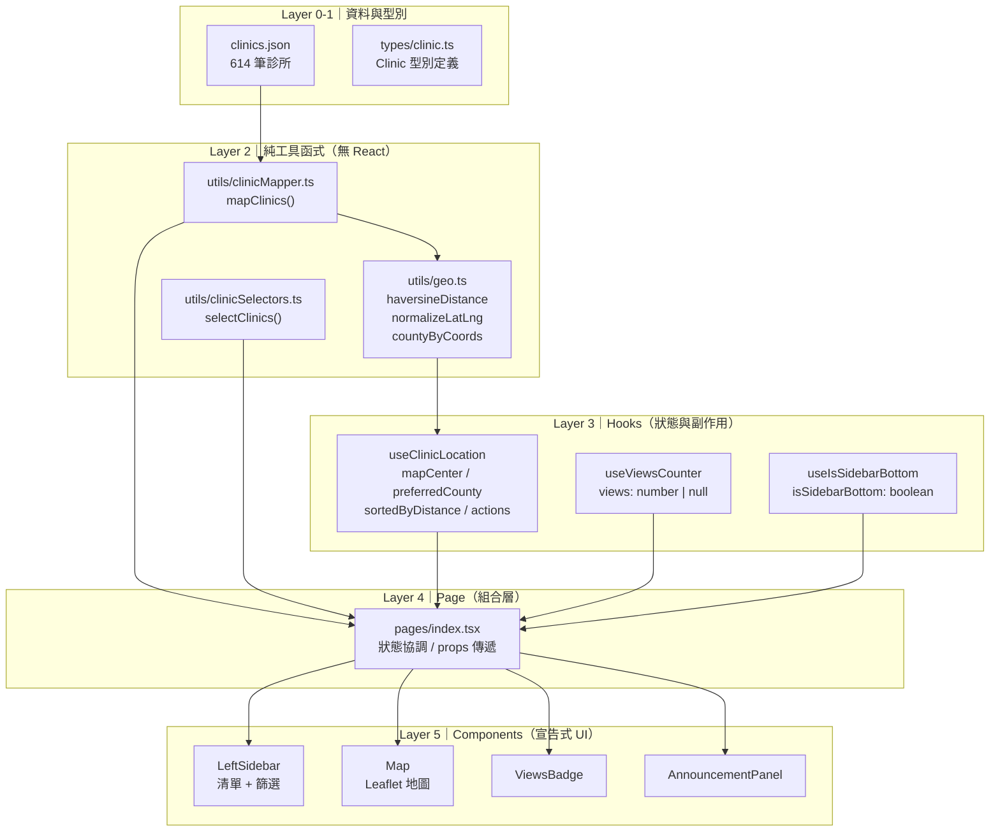

# 全台心理諮商地圖｜115年青壯世代心理健康支持方案

> 一份以架構演進為核心的前端工程作品集專案。
> 從單一頁面元件出發，經過兩波系統性重構，完成關注點分離與封裝邊界收斂。
> 本專案的重構-包含 AI 協作規範文件，用於管理重構流程與代理行為。

---

## 專案介紹

衛福部推出[「15–45 歲青壯世代心理健康支持方案」](https://dep.mohw.gov.tw/DOMHAOH/cp-502-85046-107.html)，補助每人最多 3 次免費心理諮商。然而，官方查詢介面使用門檻偏高，有需要的民眾難以快速找到**附近有名額**的合作機構。

本專案是一個**非商業公益工具**，整合全台 614 間合作診所的名額資訊，讓使用者透過地圖與清單兩種介面，快速篩選、定位、查詢可預約的資源。

- 資料來源：各縣市衛生局與衛福部官方公告
- 每週更新名額狀態
- 完全開源，MIT 授權

---

## 線上展示

**Demo：** [https://counseling-map.vercel.app/](https://counseling-map.vercel.app/)

---

## 功能特色

| 功能 | 說明 |
|------|------|
| 📍 定位與距離排序 | 讀取瀏覽器 Geolocation，依距離由近到遠排序，預設納入 30 km 內 |
| 🧩 縣市自動推斷 | 以座標比對 22 縣市重心（Haversine），統一為 `geoCounty` 欄位 |
| 🧭 座標自動校正 | 偵測 `lat/lng` 反寫，自動交換以確保地圖標記正確 |
| ✅ 名額篩選 | 全部 / 有名額 / 無名額，切換後自動重置距離排序 |
| 🔍 診所搜尋 | 依診所名稱或地址搜尋，搭配 `<datalist>` 自動建議 |
| 🗺️ 地圖標記 | Leaflet + OpenStreetMap（無需 Google Maps 金鑰） |
| 📢 公告管理 | 首次載入自動顯示，以 `localStorage` 記錄已讀狀態 |
| 👁️ 瀏覽計數 | 以 Vercel KV 記錄不重複 session 瀏覽次數 |
| 📱 RWD 響應式 | 兩段主要斷點（1170px / 768px），支援桌機、平板、手機 |

---

## 技術棧

| 類別 | 工具 / 版本 |
|------|-------------|
| 框架 | Next.js 15.4.5（Pages Router） |
| UI 函式庫 | React 19.1.0 |
| 語言 | TypeScript 5 |
| 樣式 | Tailwind CSS 4 |
| 地圖 | Leaflet 1.9.4 + react-leaflet 5.0 |
| 資料儲存 | 本地靜態 JSON（無後端） |
| 瀏覽計數 | @vercel/kv |
| 部署平台 | Vercel |

---

## 專案架構說明

本專案採用**五層架構**，每一層有明確的職責邊界：

```
src/
├── data/
│   └── clinics.json            # Layer 0：原始資料來源（614 筆）
├── types/
│   └── clinic.ts               # Layer 1：型別定義與 ID 工具函式
├── utils/
│   ├── geo.ts                  # Layer 2：純數學工具（距離、座標、縣市）
│   ├── clinicMapper.ts         # Layer 2：原始 JSON → ClinicWithGeo[]
│   └── clinicSelectors.ts      # Layer 2：清單篩選與排序邏輯
├── hooks/
│   ├── useClinicLocation.ts    # Layer 3：地理定位與距離排序狀態
│   ├── useViewsCounter.ts      # Layer 3：瀏覽計數 API 副作用
│   └── useIsSidebarBottom.ts   # Layer 3：RWD 斷點偵測
├── pages/
│   └── index.tsx               # Layer 4：頁面組合與狀態協調
└── components/
    ├── LeftSidebar.tsx          # Layer 5：診所清單 UI（桌機側欄＋手機底列）
    ├── Map.tsx                  # Layer 5：Leaflet 地圖與標記
    ├── AnnouncementPanel.tsx    # Layer 5：公告內容
    ├── ViewsBadge.tsx           # Layer 5：瀏覽數徽章
    ├── SmartButton.tsx          # Layer 5：基礎按鈕元件
    └── SmartLink.tsx            # Layer 5：基礎連結元件
```

---

## 分層設計

### Layer 0 — 原始資料

`src/data/clinics.json`：靜態 JSON，包含 614 間診所的名稱、地址、座標、名額欄位。專案無後端，資料在 build time 時直接載入。

### Layer 1 — 型別定義

`src/types/clinic.ts`：定義 `Clinic` 型別及其擴充型別，提供 `makeClinicId()`（FNV-1a 雜湊穩定 ID）、`toClinics()`（資料轉換器）等工具函式。

### Layer 2 — 純工具函式（無 React 依賴）

| 檔案 | 職責 |
|------|------|
| `geo.ts` | `haversineDistance()`：球面距離計算；`normalizeLatLng()`：座標校正；`countyByCoords()`：以座標推斷最近縣市 |
| `clinicMapper.ts` | `mapClinics()`：將原始 JSON 轉換為附帶 `geoCounty` 的 `ClinicWithGeo[]`，在頁面 module 初始化時執行一次 |
| `clinicSelectors.ts` | `selectClinics()`：依 `filter` 與 `sortedByDistance` 推導最終顯示清單 |

這一層的函式無 React 依賴，可獨立進行單元測試。

### Layer 3 — Hooks（狀態管理與副作用）

| Hook | 職責 |
|------|------|
| `useClinicLocation` | 管理地圖中心、使用者座標、縣市偏好、距離排序結果；封裝 Geolocation API 呼叫與距離排序邏輯 |
| `useViewsCounter` | 於 mount 時呼叫 GET `/api/views` 取得計數，並依 `sessionStorage` 判斷是否送出 POST +1 |
| `useIsSidebarBottom` | 監聽 `matchMedia` 斷點，回傳 `isBottom: boolean` |

### Layer 4 — Page（組合層）

`src/pages/index.tsx`：不包含業務邏輯，職責為：

1. 呼叫 hooks，取得狀態與動作
2. 以 `selectClinics()` 推導 `clinicsToShow`
3. 透過 props 將資料與回呼傳入元件

### Layer 5 — Components（宣告式 UI）

元件只負責渲染與事件上報，不直接操作外部狀態：

- `LeftSidebar`：桌機左側固定欄（寬 320px）＋手機底部水平捲動列，顯示診所清單與篩選按鈕
- `Map`：Leaflet 地圖，管理 Marker refs、Popup 開關、使用者定位 circle
- `AnnouncementPanel`：公告內容區塊（純內容，無狀態）
- `ViewsBadge`：接收 `views: number | null`，渲染瀏覽計數

---

## 資料流說明

```
clinics.json（原始靜態 JSON）
        │
        ▼
mapClinics()           ← clinicMapper.ts
  normalizeLatLng()    ← geo.ts（校正反寫座標）
  countyByCoords()     ← geo.ts（推斷 geoCounty）
        │
        ▼
clinicsAll: ClinicWithGeo[]    ← 頁面 module 層級常數，初始化一次
        │
        ├──────────────────────────────────────┐
        │                                      │
        ▼                                      ▼
selectClinics({ filter,             selectClinics({ filter,
  sortedByDistance: null })           sortedByDistance })
        │                                      │
        ▼                                      ▼
clinics[]                          clinicsToShow[]
（datalist 自動補全用）              （Sidebar + Map 顯示用）
                                               │
                                   ┌───────────┴───────────┐
                                   ▼                       ▼
                              LeftSidebar             ClinicsMap
```

**地理定位側路徑：**

```
navigator.geolocation（useClinicLocation 內部）
        │
        ▼
sortClinicsByDistanceFrom(lat, lng)
  countyByCoords()     ← 推斷所在縣市
  haversineDistance()  ← 逐一計算距離
  filter ≤ 30 km，sort 升冪
        │
        ├── setSortedByDistance() → 回饋至 selectClinics
        ├── setSelectedClinicId() → 觸發 Map Popup 開啟
        └── setMapCenter()        → ClinicsMap.center prop
```

---

## 架構圖



---

## 重構歷程

本專案以功能先行、架構後行的方式開發，並記錄兩波系統性重構的演進過程。

### Refactor Wave 1｜關注點分離

**背景**：初版 `index.tsx` 約 540 行，同時承擔六種不同職責：

- 純數學工具函式（Haversine、座標校正）
- 靜態地理資料（22 縣市重心）
- 資料轉換（補 id、校正座標、推斷 geoCounty）
- 瀏覽計數 API 副作用
- 地理定位與距離排序邏輯
- 公告狀態與 localStorage 管理

**執行動作**：

| 抽離目標 | 抽離至 | 說明 |
|----------|--------|------|
| 數學工具函式 | `utils/geo.ts` | 純函式，零 React 依賴 |
| 資料轉換邏輯 | `utils/clinicMapper.ts` | 原始 JSON → `ClinicWithGeo[]` |
| 篩選推導邏輯 | `utils/clinicSelectors.ts` | `filter + sortedByDistance` → 顯示清單 |
| 瀏覽計數副作用 | `hooks/useViewsCounter.ts` | fetch + sessionStorage 完全封裝 |
| RWD 斷點偵測 | `hooks/useIsSidebarBottom.ts` | `matchMedia` 監聽 |
| 地理定位排序 | `hooks/useClinicLocation.ts` | Geolocation API + 距離排序狀態 |

**結果**：`index.tsx` 縮減至約 230 行，僅負責組合與協調。

---

### Refactor Wave 2｜封裝邊界收斂

**背景**：Wave 1 後，`useClinicLocation` 雖然抽離了邏輯，但仍將四個內部 setter 直接暴露給 `index.tsx`：

```ts
// Wave 1 後的 return（問題所在）
return {
  setUserLatLng,       // Home 直接寫入 hook 內部狀態
  setMapCenter,        // 在 JSX 中被 3 個地方直接呼叫
  setPreferredCounty,  // Home 知道需要傳 null
  setSortedByDistance, // Home 知道需要傳 null，且出現 2 次
  ...
};
```

**問題**：`index.tsx` 對 hook 的內部資料結構（陣列格式、null 語意）有直接依賴，封裝邊界被穿透。

**執行動作**：以具名語意動作替換 raw setter：

| 替換前（raw setter） | 替換後（具名動作） | 語意 |
|---------------------|--------------------|------|
| `setMapCenter([lat, lng])` | `moveMapTo(lat, lng)` | 移動地圖視角 |
| `setUserLatLng([lat, lng])` | `onUserLocate(lat, lng)` | Map 回報使用者座標 |
| `setPreferredCounty(null)` + `setSortedByDistance(null)` | `clearPreferredSort()` | 清除縣市偏好與排序 |
| `setSortedByDistance(null)` | `clearDistanceSort()` | 僅清除排序結果 |

`userLatLng` 從 return 中移除，降為 hook 內部狀態（僅 `sortClinicsByDistance` 消費）。

**結果**：`index.tsx` 無法再直接操作 hook 的內部 setter，呼叫介面改為語意清楚的動作名稱。

---

## 安裝與啟動

```bash
# 1. 安裝依賴
npm install

# 2. 啟動開發模式
npm run dev
# 開啟 http://localhost:3000

# 3. 正式建置
npm run build

# 4. 啟動正式伺服器
npm start
```

---

## 部署說明

本專案推薦部署至 **Vercel**，支援 Next.js 零設定部署。

**環境變數（Vercel KV 瀏覽計數）：**

| 變數名稱 | 說明 |
|----------|------|
| `KV_REST_API_URL` | Vercel KV 的 REST endpoint |
| `KV_REST_API_TOKEN` | Vercel KV 的存取 token |

若不需要瀏覽計數功能，可移除 `ViewsBadge` 元件與相關 API route，不影響主要診所查詢功能。

**OSM 授權**：使用 Leaflet + OpenStreetMap 時，請保留 `<TileLayer>` 中的 attribution 字串，以符合 ODbL 授權要求。

---

## 授權

| 項目 | 授權 |
|------|------|
| 本專案程式碼 | MIT License |
| 地圖圖磚 | © OpenStreetMap 貢獻者（ODbL） |
| 診所資料 | 源自衛福部心理諮商合作機構公告，供公益用途使用 |

---

> 本專案以「功能完整、架構演進、記錄清楚」為目標，
> 作為前端工程師展示系統性重構思維的作品集項目。
